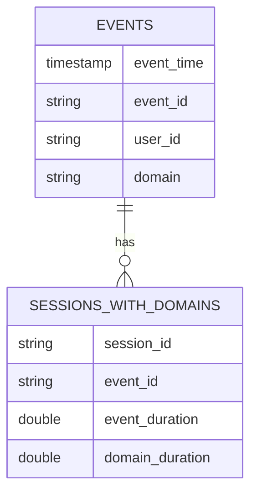

# Test Assignment for Behavix
The [task](./test_assignment.pdf) is to write a script that calculates web sessions based on the sample data. 

Given the requirements of being able to run the solution locally, and no restrictions for the programming languages and/or toolsets, as the fastest first iteration I have taken good ol' SQL spiced by superpowers of DuckDB (native parquet and CTEs support, window functions) and wrapped with bash for convenience. Surely, more powerful data crunching engines like Apache Spark might become appropriate for larger input sizes - however the logic of transformations might remain much similar.

## Setup
* Get the DuckDB CLI following the [guide](https://duckdb.org/docs/installation/index?version=stable&environment=cli&platform=macos&download_method=package_manager). Eg for Mac:
```commandline
brew install duckdb
```
* To confirm that DuckDB is callable please run: `duckdb --version`
* Download the input data file. To simplify, let's assume you will download the `test_assignment_1000.parquet` events input file and save it as `events.parquet` in the project dir

## Run the ETL
```commandline
./calculate_web_sessions.sh data.parquet sessions.parquet
```

## Quick thoughts
On the first sight the requested ER design (`events` is the original input file, `sessions_with_domains` for the result output) has denormalized thus repeated `domain_duration` field. 


In case when the denormalization is sought by intent, one might produce enriched sessions with all fields from events (i.e. `user_id`, `event_time`, `domain`, `session_id`, `event_id`, `event_duration`, `domain_duration`).

Otherwise, it might be good to normalize and to create more entities in addition to original `events`: `domains` , `sessions`.